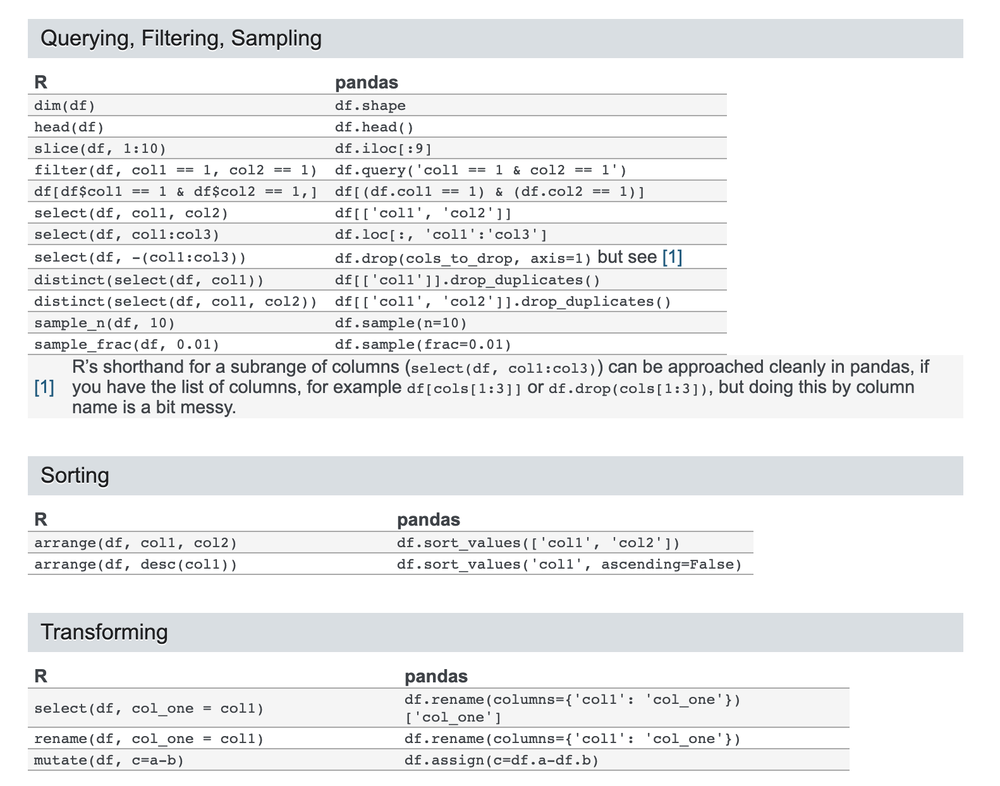
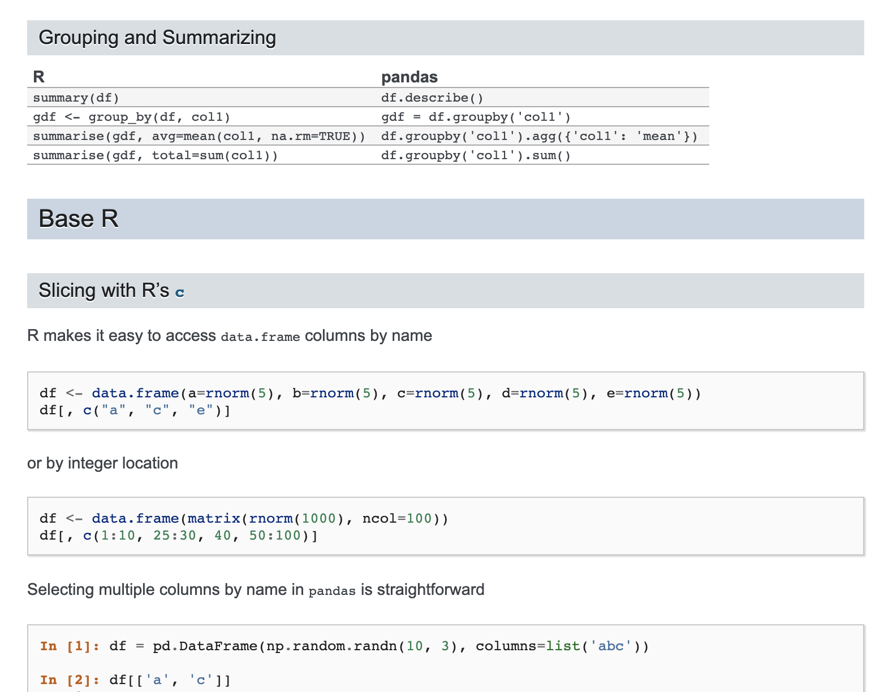

Table of Contents
=================
   * [Comparison from pandas official document](#comparison-from-pandas-official-document)
   * [Package Installation](#package-installation)
   * [Basic functions](#basic-functions)
   * [Create dataframe](#create-dataframe)
   * [Dataframe attributes](#dataframe-attributes)
   * [Data frame Summary](#data-frame-summary)
      * [data.frame sorting data](#dataframe-sorting-data)
      * [data.frame selection](#dataframe-selection)
      * [data.frame filtering/subsetting](#dataframe-filteringsubsetting)
   * [Math functions](#math-functions)
   * [Data Manipulation](#data-manipulation)
      * [Date Manipulation](#date-manipulation)
   * [Data Visualization](#data-visualization)

# Comparison from pandas official document
[pandas vs R](https://pandas.pydata.org/pandas-docs/stable/getting_started/comparison/comparison_with_r.html)



# Package Installation

```
# Let us use conda to get all the packs we need
conda install pandas
```

```r
install.packages(c("e1071", "kknn", "randomForest", "rpart"))

# extra libs to compile this document
devtools::install_github("yihui/runr")
```

# Basic functions

Functions | R | Python
|:---|:---|:---|
Downloading and installing a package | install.packages('name') | pip install name
Load a package | library('name') | import name as other_name
Checking working directory | getwd() | import os;os.getcwd()
Setting working directory |setwd() | os.chdir()
List files in a directory |dir() | os.listdir()
List all objects  | ls() | globals()
Remove an object  | rm('name')  | del('object')

# Create dataframe


```r
A <- matrix(runif(24,0,1), nrow=6, ncol=4)
df <- data.frame(A)
print(df)
```

```python
import numpy as np
import pandas as pd
A=np.random.randn(6,4)
df=pd.DataFrame(A)
print(df)
```

# Dataframe attributes


function | R | Python
|:---|:---|:---|
number of rows | `rownames(df)` | `df.index`
number of coliumns | `colnames(df)` | `df.columns`
first few rows | `head(df)` | `df.head()`
last few rows | `tail(df)` | `df.tail()`
get dimensions| `dim(df)` | `df.shape`
length of df | `length(df)` | `len(df)`

# Data frame Summary

function | R | Python
|:---|:---|:---|
quick summary including mean/std. dev etc | `summary(df)` | `df.describe()`
setting row and column names | `rownames(df) = c("a", "b")` <br> `colnames(df) = c("x", "y")`| `df.index = ["a", "b"]` <br> `df.columns = ["x", "y"]`

## data.frame sorting data

function | R | Python
|:---|:---|:---|
sorting the data  | `df[order(df$x)]` | `df.sort(['x'])`

## data.frame selection

function | R | Python
|:---|:---|:---|
slicing a set of rows, from row number x to y  | `df[x:y, ]` | `df[x-1:y]` <br> Python starts counting from 0
slicing a column names  | `df[, "a"]` <br> `df$a` <br> `df["a"]` | `df.loc[:, ['a']], df.a`
slicing a column and rows  | `df[x:y, x:y]`  | `df.iloc[x-1:y, a-1,b]`
extract specific element |  `df[x, y]`  | `df.iloc[x-1, y-1], df.iat[x-1,y-1]`

## data.frame filtering/subsetting

function | R | Python
|:---|:---|:---|
subset rows where x>5 | `subset(df, x>5)` | `df[df.A> 5]`


# Math functions

function | R | Python
|:---|:---|:---|
sum | `sum(x)` | `math.fsum(x)`
square root | `sqrt(x)` | `math.sqrt(x)`
standard deviation | `sd(x)` | `numpy.std(x)`
log | `log(x)` | `math.log(x)`
mean | `mean(x)` | `numpy.mean(x)`
median | `median(x)` | `numpy.media(x)`

# Data Manipulation

function | R | Python
|:---|:---|:---|
convert character to numeric | `as.numeric(x)` | for single values: `int(x)`, `long(x)`, `float(x)` <br> for list, vectors: `map(int, x)`, `map(long, x)`, `map(float, x)`
convert numeric to character | `as.character(x)` <br> `paste(x)` | for single values: `str(x)` <br> for list, vectors: `map(str, x)`
check missing value | `is.na(x)` <br> `is.nan(x)` | `math.is.nan(x)`
remove missing value | `na.omit(x)` | [x for x in list if str(x) != 'nan']
number of chars. in value | `char(x)` | `len(x)`

## Date Manipulation

function | R (`lubridate`) | Python
|:---|:---|:---|
Getting time and date | `Sys.time()` | `d=datetime.date.time.now()`
parsing date and time: <br> `YYYY MM DD HH:MM:SS` | `lubridate::ymd_hms(Sys.time())` | `d.strftime("%Y %b %d %H:%M:%s")`

# Data Visualization

function | R | Python
|:---|:---|:---|
Scatter Plot | ` plot(variable1,variable2)`|`import matplotlib` <br> `plt.scatter(variable1,variable2);plt.show()`
Boxplot | `boxplot(Var)`|`plt.boxplot(Var);plt.show()`
Histogram | `hist(Var)` | `plt.hist(Var) plt.show()`
Pie Chart | `pie(Var)` | `from pylab import *` <br> `pie(Var) show()`
