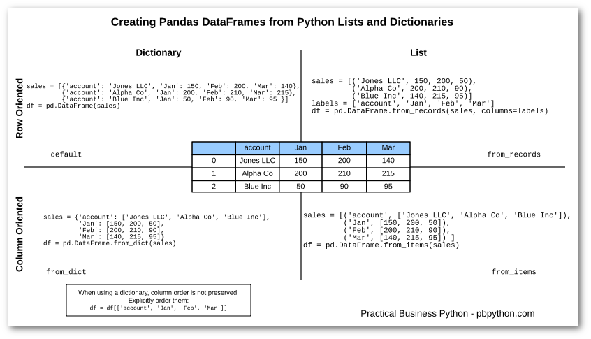

Table of Contents
=================
   * [ABC](#abc)
   * [Mock data websites](#mock-data-websites)
   * [summary](#summary)
   * [using numpy](#using-numpy)
   * [using lists](#using-lists)
   * [using list zip](#using-list-zip)
   * [using dictionary with list or series elements](#using-dictionary-with-list-or-series-elements)
   * [using itertools product](#using-itertools-product)
   * [using read_fwf   (fixed width file)](#using-read_fwf---fixed-width-file)
   * [using io.StringIO](#using-iostringio)
   * [using list having dictionaries (from_dict)](#using-list-having-dictionaries-from_dict)
   * [using list comprehension](#using-list-comprehension)
   * [using from_dict and from_records](#using-from_dict-and-from_records)
   * [using from_items](#using-from_items)
   * [using faker module](#using-faker-module)
   * [Creating dataframe using np.core.defchararray.add](#creating-dataframe-using-npcoredefchararrayadd)
   * [make tiles of dataframes](#make-tiles-of-dataframes)


# ABC
```python
data = np.random.randn(10) # 10 gaussian numbers between 0 and 1
data = np.random.randn(2,4) # same as 
data = np.random.standard_normal(size=(2,4)) # also gamma, t, exponential, cauchy,
data = np.random.randint(2, size=10)
data = np.random.randint(low=5,high=10,size=(10,2))

# dates
pd.date_range(start='1/1/2018', end='1/08/2018')
pd.date_range(start='1/1/2018', periods=8)  # we can also only use end
pd.date_range(start='1/1/2018', periods=5, freq='M')

# fake module
# name, name_male, address, am_pm, city, company, country, country_code
# credit_card_number, currency, currency_code, date, date_between, etc
from faker import Faker
fake = Faker()
names = [fake.name() for _ in range(10)]
```

# Mock data websites
https://mockaroo.com/

# summary


# using numpy
```python
data = np.arange(6*2).reshape((6,2))
data = np.random.randn(6,2)
df = pd.DataFrame(data)
df = pd.DataFrame(data, index=list('abcdef'),columns=['c0','c1'])
```


# using lists
```python
import pandas as pd
data = [1,2,3,4,5]
df = pd.DataFrame(data)
print(df)
     0
0    1
1    2
2    3
3    4
4    5


# list of list
import pandas as pd
data = [['Alex',10],['Bob',12],['Clarke',13]]
df = pd.DataFrame(data,columns=['Name','Age'])
print(df)
      Name      Age
0     Alex      10
1     Bob       12
2     Clarke    13

# list of list dtype float
import pandas as pd
data = [['Alex',10],['Bob',12],['Clarke',13]]
df = pd.DataFrame(data,columns=['Name','Age'],dtype=float)
print(df)
      Name     Age
0     Alex     10.0
1     Bob      12.0
2     Clarke   13.0
```

# using list zip
```python
import numpy as np
import pandas as pd

months = ['Jan','Apr','Mar','June']
days = [31,30,31,30]
columns = ['month','day']

df = pd.DataFrame(list(zip(months,days)), columns=columns)
print(df)
  month  day
0   Jan   31
1   Apr   30
2   Mar   31
3  June   30
```

# using dictionary with list or series elements
```python
import pandas as pd
data = {'Name':['Tom', 'Jack', 'Steve', 'Ricky'],'Age':[28,34,29,42]}
df = pd.DataFrame(data)
print(df)
      Age      Name
0     28        Tom
1     34       Jack
2     29      Steve
3     42      Ricky

# list having dictionaries
import pandas as pd
data = [{'a': 1, 'b': 2},{'a': 5, 'b': 10, 'c': 20}]
df = pd.DataFrame(data)
print(df)
    a    b      c
0   1   2     NaN
1   5   10   20.0


# dict of series
import pandas as pd

d = {'one' : pd.Series([1, 2, 3], index=['a', 'b', 'c']),
      'two' : pd.Series([1, 2, 3, 4], index=['a', 'b', 'c', 'd'])}

df = pd.DataFrame(d)
print(df)
      one    two
a     1.0    1
b     2.0    2
c     3.0    3
d     NaN    4
```

# using itertools product
```python
import itertools as it

import numpy as np
import pandas as pd
np.random.seed(100)

datecols = ['year', 'month', 'day']

df = pd.DataFrame(list(it.product([1961, 1962], [1, 2], [1, 2, 3])),
                  columns=datecols)

# add another column
df['data'] = np.random.randn(len(df))
print(df)

  year	month	day	data
0	1961	1	1	-1.749765
1	1961	1	2	0.342680
2	1961	1	3	1.153036
3	1961	2	1	-0.252436
4	1961	2	2	0.981321
5	1961	2	3	0.514219
6	1962	1	1	0.221180
7	1962	1	2	-1.070043
8	1962	1	3	-0.189496
9	1962	2	1	0.255001
10	1962	2	2	-0.458027
11	1962	2	3	0.435163
```

# using read_fwf   (fixed width file)
```python
import io

text = """\
name     title              salary
Ryxlar   Chief Dragon Slayer20000
Tiqla    Assistant Alchemist4000
Brynz    Brute Squad        1000
Mr PotatoMess Cook          35000
"""

df = pd.read_fwf(io.StringIO(text), widths=[9,19,6])
df

## mulitple texts
texts = ['''\
id   Name   score                    isEnrolled                       Date
111  Jack                            True              2013-05-01 12:00:00
112  Nick   1.11                     False             2013-05-12 15:05:23
     Zoe    4.12                     True                                  ''',

         '''\
id   Name   score                    isEnrolled                       Date
111  Jack   2.17                     True              2013-05-01 12:00:00
112  Nick   1.21                     False
     Zoe    4.12                     False             2013-05-01 12:00:00''']


df1 = pd.read_fwf(io.StringIO(texts[0]), widths=[5,7,25,17,20], parse_dates=[4])
df2 = pd.read_fwf(io.StringIO(texts[1]), widths=[5,7,25,17,20], parse_dates=[4])
df1
```


# using io.StringIO
```python
import numpy as np
import pandas as pd
import io

t="10,20,30"
df = pd.read_csv(io.StringIO(t), header=None)
df

   0	1	2
0	10	20	30


# example 2
import numpy as np
import pandas as pd
import io

data = io.StringIO('''Fruit,Color,Count,Price
Apple,Red,3,$1.29
Apple,Green,9,$0.99
Pear,Red,25,$2.59
Pear,Green,26,$2.79
Lime,Green,99,$0.39
''')

df = pd.read_csv(data)
df = df.set_index(['Fruit', 'Color'])
# df['Price'] = df['Price'].apply(lambda x: x.lstrip('$'))
print(df)

             Count  Price
Fruit Color
Apple Red        3  $1.29
      Green      9  $0.99
Pear  Red       25  $2.59
      Green     26  $2.79
Lime  Green     99  $0.39


## another example
import numpy as np
import pandas as pd
import sys
if sys.version_info[0] < 3:
    from StringIO import StringIO
else:
    from io import StringIO


DF = StringIO("""id   Name   score                    isEnrolled           Comment
111  Jack   2.17                     True                 "He was late to class"
112  Nick   1.11                     False                "Graduated"
113  Zoe    NaN                     True                  " "
""")


df = pd.read_table(DF, sep='\s+', index_col='id')
df1


```

# using list having dictionaries (from_dict)
```python

import numpy as np
import pandas as pd
L = [('ab', {'a' : ['apple1'], 'b': ['ball1']}),
     ('cd', {'a' : ['apple2'], 'b': ['ball2']})]

# make list a dict and use from_dict, then orient=index will make dict keys the indices.
df = pd.DataFrame.from_dict(dict(L), orient='index')
print(df)
           a        b
ab  [apple1]  [ball1]
cd  [apple2]  [ball2]

# remove list
df = df.apply(lambda x: x.str[0])  # x.str[1] gives second element if exist
         a      b
ab  apple1  ball1
cd  apple2  ball2

# method2
index, data = zip(*L)
df = pd.DataFrame(list(data), index=index)
df = df.applymap(lambda l: l[0])
df = df.applymap(lambda l: ', '.join(l)) # if we have more than one elements
```

# using list comprehension
```python
data = [[_ for _ in range(j,j+4)] for j in range(0,30,10)]
df = pd.DataFrame(data)
print(df)
    0   1   2   3
0   0   1   2   3
1  10  11  12  13
2  20  21  22  23

```

# using from_dict and from_records
https://pbpython.com/pandas-list-dict.html
```python
sales = [('Jones LLC', 150, 200, 50),
         ('Alpha Co', 200, 210, 90),
         ('Blue Inc', 140, 215, 95)]

df1 = pd.DataFrame(sales) # gives 3 rows and 4 columns similar to data above
df2 = pd.DataFrame.from_records(sales, columns=['account', 'Jan', 'Feb', 'Mar']) # 3 rows, 4 cols
```

# using from_items
https://pbpython.com/pandas-list-dict.html
```python
sales = [('acc', ['A', 'B', 'C']),
         ('Jan', [150, 200, 50]),
         ('Feb', [200, 210, 90]),
         ('Mar', [140, 215, 95]),
         ]
df1 = pd.DataFrame.from_items(sales)
df2 = pd.DataFrame(sales) # gives 4 rows and two columns (second column has lists)
```

# using faker module
```python
import pandas as pd
import random
from faker import Faker


fake = Faker()

#import a Provider
from faker.providers import BaseProvider

# create my new provider class
class MyProvider(BaseProvider):
    # define a method that return a random expense type
    def expenseType(self):
        foo = ['Food_Drink', 'Transportation', 'Clothes',
               'Rent', 'Entertainment', 'Bills']
        return random.choice(foo)

# then add my new provider to faker instance
fake.add_provider(MyProvider)

def createFakeDataset(num_examples):
    """Function that creates a fake dataset using the python module Faker

    Args:
        num_examples (int): number of fake examples to generate

    Returns:
        pandas.core.frame.DataFrame: the final dataframe

    """

    fake.seed(100)

    l_dates = []
    l_cards = []
    l_types = []
    l_amounts = []

    for _ in range(num_examples):
        # create a fake date within a week
        l_dates.append(fake.date_time_between(start_date="-7d",
                                              end_date="now", tzinfo=None).date())
        # create a fake card number
        l_cards.append(fake.credit_card_number())
        # create a fake expenseType
        l_types.append(fake.expenseType())
        # create a fake amount of money
        l_amounts.append(fake.random_int(min=0, max=1000))

    # create a dataframe
    df = pd.DataFrame({'date': l_dates, 'card_number': l_cards,
                       'type': l_types, 'amount': l_amounts})
    # convert string to datetime
    df['date'] = pd.to_datetime(df['date'])

    return df

# create dataframe
df = createFakeDataset(10000)    # Rem: After multiple groupby remember to unstack and plot
df.groupby(['date','type']).count()['amount'].unstack().plot() # x = date, y = daily transanction counts
```

# Creating dataframe using np.core.defchararray.add
https://stackoverflow.com/questions/47152691/how-to-pivot-a-dataframe
```python
import numpy as np
import pandas as pd
from numpy.core.defchararray import add

np.random.seed([3,1415])
n = 20

cols = np.array(['key', 'row', 'item', 'col'])
arr1 = (np.random.randint(5, size=(n, 4)) // [2, 1, 2, 1]).astype(str)

df = pd.DataFrame(add(cols, arr1), columns=cols)\
       .join(pd.DataFrame(np.random.rand(n, 2).round(2)).add_prefix('val'))
df

     key   row   item   col  val0  val1
0   key0  row3  item1  col3  0.81  0.04
1   key1  row2  item1  col2  0.44  0.07
2   key1  row0  item1  col0  0.77  0.01
3   key0  row4  item0  col2  0.15  0.59
4   key1  row0  item2  col1  0.81  0.64
5   key1  row2  item2  col4  0.13  0.88
6   key2  row4  item1  col3  0.88  0.39
7   key1  row4  item1  col1  0.10  0.07
8   key1  row0  item2  col4  0.65  0.02
9   key1  row2  item0  col2  0.35  0.61
10  key2  row0  item2  col1  0.40  0.85
11  key2  row4  item1  col2  0.64  0.25
12  key0  row2  item2  col3  0.50  0.44
13  key0  row4  item1  col4  0.24  0.46
14  key1  row3  item2  col3  0.28  0.11
15  key0  row3  item1  col1  0.31  0.23
16  key0  row0  item2  col3  0.86  0.01
17  key0  row4  item0  col3  0.64  0.21
18  key2  row2  item2  col0  0.13  0.45
19  key0  row2  item0  col4  0.37  0.70
```

# make tiles of dataframes
```python
df = pd.DataFrame({'A': [1,2,3]})
pd.concat([df]*3,ignore_index=True)  # df*3 and [df]*3 are different!
```
