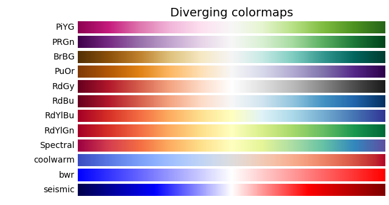
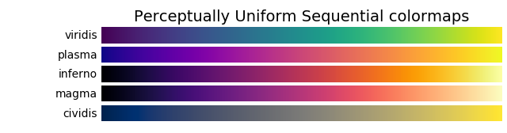
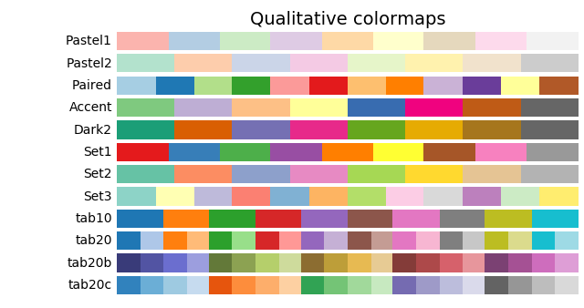
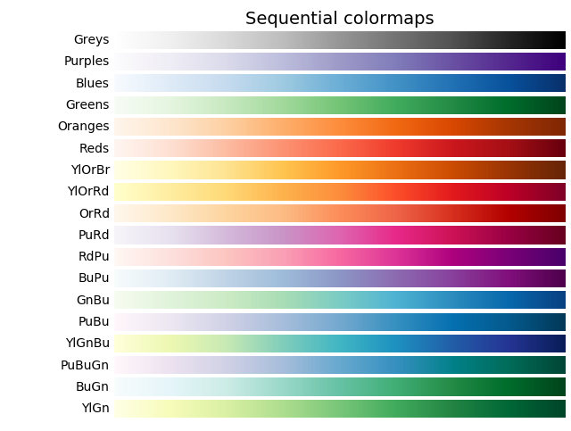
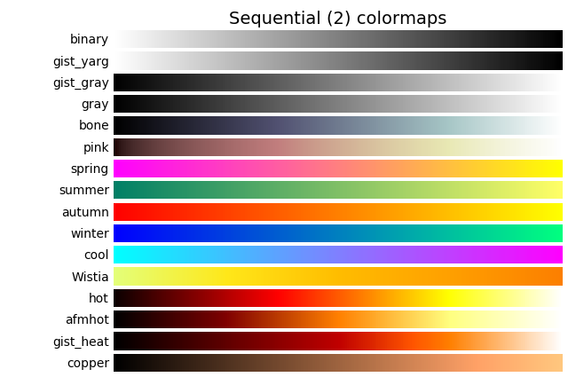

Table of Contents
=================
   * [Pandas <strong>visualizations</strong>](#pandas-visualizations)
   * [scatterplot](#scatterplot)
   * [odd number of subplots](#odd-number-of-subplots)
   * [Seaborn plots](#seaborn-plots)
   * [monthly plot and two boxplots](#monthly-plot-and-two-boxplots)
   * [Collection](#collection)
   * [Titanic stacked barplot](#titanic-stacked-barplot)
   * [plot using pivot table](#plot-using-pivot-table)
   * [Matplotlib color cmaps](#matplotlib-color-cmaps)

# Pandas **visualizations**
- Pandas plot requires multi-index data and the index-names becomes xticklabels.
- Seaborn plots requires flat table and has more options than pandas.
- Groupby columns becomes index, unstack(level=0) moves index to column, pandas uses index as x-axis.

```python
## data
np.random.seed(100)
df = pd.DataFrame(np.random.rand(10, 4), columns=['a', 'b', 'c', 'd'])
iris = sns.load_dataset('iris') # similarly tips, and titanic.

## syntax:
fig, ax = plt.subplots()
df.plot(kind='bar', x='x',y='y',title='',    # kind: line, bar, barh, hist, box, kde
        grid=False,legend=True,stacked=False # kind: density, area(stacked=False), pie, scatter, hexbin
        figsize=(12,8),ax=ax  # barplot color = sns.color_palette('husl',7)
        style=['-','--'])

## Additional options
plt.figure(figsize=(45,10))
plt.tight_layout()
plt.text(0,6e9,'text',fontsize=20)
plt.subplots(figsize=(20,15))
plt.xticks(rotation=70)

## Examples
df.plot.line() # line plot of all columns
df.plot.bar();  # color=sns.color_palette('husl',4) , stacked=True
df.plot.bar(y='col2', use_index=True, color=sns.color_palette('plasma')) # using index as x-axis
df.hist('mycol', bins=np.arange(0.5,mymax,1) # 0.5 causes histograms bins to centering
df.plot(kind='bar') # kind='barh' 'box' 'area' 'kde' 'line'
df.plot(kind='line', y=['a','b'], style=['-',':'])
titanic.groupby(['class','sex'])['survived'].sum().unstack().plot.bar() # NOTE: colors of sns and pd are different.
sns.barplot( x='class',y='survived',hue='sex',estimator=sum, data=titanic)

## scatterplot
titanic.plot(x='age', y='fare', kind='scatter', color= titanic['survived'].map({0:'red', 1:'green'}))
sns.scatterplot(x='age', y='fare', hue='survived',data=titanic,
                size= 'fare',sizes=(10, 100),palette={0: 'r',1:'g'})
**matplotlib
plt.figure(figsize=(12, 8))
ax = plt.subplot()
ax.scatter(titanic[titanic['survived'] == 1]['age'],titanic[titanic['survived'] == 1]['fare'],
           c='green', s=titanic[titanic['survived'] == 1]['fare'])

ax.scatter(titanic[titanic['survived'] == 0]['age'],titanic[titanic['survived'] == 0]['fare'],
           c='red', s=titanic[titanic['survived'] == 0]['fare']);
ax.set(xlabel='age',ylabel='fare')
plt.legend(['alive','dead'])

## Lineplot
sns.set()
plt.plot(df.values) # solid line plots
plt.legend('ABCDEF', ncol=2, loc='upper left');

## two columns crosstab
pd.crosstab(titanic.pclass, titanic.survived).plot.bar()
pd.crosstab(titanic.pclass, titanic.survived, values=titanic.survived, aggfunc='count').plot.bar()
titanic.groupby(['pclass','survived'])['survived'].count().unstack(level=-1).plot.bar() # for unstack -1 is default.
sns.countplot(x='pclass',hue='survived',data=titanic) # looks best

## countplot
titanic['class'].value_counts().plot.bar() # .sort_index().plot.bar()
sns.countplot('class',data=titanic)
sns.catplot(kind='count', x='class', data=titanic)

## pipe pandas dataframe to sns.plot
titanic[titanic.sex == 'male'].pipe((sns.barplot,'data'), x='class',y='fare')

## Pie plot (seaborn does not support pie plot, pandas and matplotlib supports it)
titanic.groupby('sex')['survived'].sum().plot(kind='pie',y='survived',
             autopct="%1.0f%%",shadow=False,startangle=90,rotatelabels=True,explode=None,
             figsize=(10,10),colors=sns.color_palette('terrain',len(df)),
             textprops={'fontsize': 14},
             wedgeprops={"linewidth":2,"edgecolor":"white"});
plt.ylabel('')
plt.title('Pie plot of {}'.format(),fontsize=14)

## timeseries
n = 365
df = pd.DataFrame(data = {"A":np.random.randn(n), "B":np.random.randn(n)+1},
                  index=pd.date_range(start="2017-01-01", periods=n, freq="D"))
(df.stack().reset_index().set_axis(['month','vars','vals'],axis=1,inplace=False)
   .set_index('month',drop=False)
   .pipe(lambda x: sns.boxplot(x=x.index.month, y="vals", hue="vars", data=x)))

## subplots
df = sns.load_dataset('mpg')
g = df.groupby('origin')
fig, axes = plt.subplots(2,2,figsize=(8, 4))
for i, (g_name, g_data) in enumerate(g): # axes.flat[i] also works
    ax = g_data.plot.scatter(x='cylinders', y='mpg', ax=axes.flatten()[i], title=g_name)
plt.tight_layout()
fig.delaxes(axes[1][1]) # or, axes[1][1].set_visible(False)

## text statistics on figure
df = pd.DataFrame(np.random.normal(size=(2000,)))
fig, ax = plt.subplots()
ax.hist(df[0])
plt.figtext(0.1,0.5, df.describe().to_string())
plt.figtext(0.75,0.5, df.describe().loc[['mean','std']].to_string())

##============= Seaborn plot ==================
## sns categorical plot
## scatter: kind = strip, swarm
## distribution: kind = box, violin, boxen
## categorical estimate: kind = point, bar, count
g = sns.catplot('c0', data=df, hue='c1', palette='husl', kind='count')
g.set(ylim=(0,1))
g.despine(left=True)

# scatterplot
sns.scatterplot(data=df, x='c0', y='c1', hue='c2', size='c4', style='c5',
                palette=('Blues',7), marker={'c0': 's', 'c1': 'X'})

## Repeated x-axis labels
ax = sns.barplot(x= list(range(len(x_vals))), y = y_vals )

ax.set_xticklabels(["{:d}".format(int(v)) for v in x_vals]) # if x_vals are integers
ax.set_xticklabels(x_vals) # if x_vals are strings.

## seaborn FacetGrid
g = sns.FacetGrid(tips, col="sex", hue="smoker",margin_titles=True)
g.map(plt.scatter, "total_bill", "tip", alpha=.7)
g.add_legend();

*example FacetGrid
g = sns.FacetGrid(tips, hue="sex", palette="Set1", height=5, hue_kws={"marker": ["^", "v"]})
g.map(plt.scatter, "total_bill", "tip", s=100, linewidth=.5, edgecolor="white")
g.add_legend();

**example FacetGrid
g = sns.FacetGrid(tips, row="smoker", col="time", margin_titles=True,palette='Set1')
g.map(sns.regplot, "size", "total_bill", fit_reg=True, x_jitter=.1);

## seaborn PairGrid
g = sns.PairGrid(iris, vars=["sepal_length", "sepal_width"], hue="species")
g.map_diag(plt.hist)
g.map_upper(plt.scatter)  # g.map_offdiag(plt.scatter)
g.map_lower(sns.regplot)
g.add_legend();

**
g = sns.pairplot(iris, hue="species", palette="Set2", diag_kind="kde", height=2.5)
```

# scatterplot
```python
# seaborn
sns.set()
plt.figure(figsize=(12,8))

pal = {0: 'r',1:'b'}
sns.scatterplot(x='Age', y='Fare', hue='Survived',data=train,
                size= 'Fare',sizes=(40, 400),palette=pal)

# matplotlib
plt.figure(figsize=(12, 8))
ax = plt.subplot()

ax.scatter(titanic[titanic['survived'] == 1]['age'],
           titanic[titanic['survived'] == 1]['fare'], 
           c='green', s=titanic[titanic['survived'] == 1]['fare'])

ax.scatter(titanic[titanic['survived'] == 0]['age'],
           titanic[titanic['survived'] == 0]['fare'], 
           c='red', s=titanic[titanic['survived'] == 0]['fare']);
ax.set(xlabel='age',ylabel='fare')
plt.legend(['alive','dead'])
```

# odd number of subplots
Also see these sites:
- https://stackoverflow.com/questions/41025187/matplotlib-add-subplot-odd-number-of-plots
```python
df = sns.load_dataset('mpg')
g = df.groupby('origin')

fig, axes = plt.subplots(2,2,figsize=(8, 4))
for i, (g_name, g_data) in enumerate(g): # axes.flat[i] also works
    ax = g_data.plot.scatter(x='cylinders', y='mpg', ax=axes.flatten()[i], title=g_name)

plt.tight_layout()
fig.delaxes(axes[1][1]) # or, axes[1][1].set_visible(False)
```

# Seaborn plots
```python
import numpy as np
import pandas as pd
import seaborn as sns
sns.set()

## scatter plot
rng = np.random.RandomState(0)
x = np.linspace(0, 10, 500)
y = np.cumsum(rng.randn(500, 6), 0)
plt.plot(x, y)
plt.legend('ABCDEF', ncol=2, loc='upper left');

**using seaborn
for c in df.columns:
    sns.lineplot(data=df[c],label=c)

**using pandas
df.plot.line()

## Histograms
data = np.random.multivariate_normal([0, 0], [[5, 2], [2, 2]], size=2000)
data = pd.DataFrame(data, columns=['x', 'y'])

for col in 'xy':
    plt.hist(data[col], normed=True, alpha=0.5)

## KDE
for col in 'xy':
    sns.kdeplot(data[col], shade=True)

## hist and kde
sns.distplot(data['x'])
sns.distplot(data['y']);

## pairplot
sns.pairplot(iris, hue='species', size=2.5);

## facets
tips['tip_pct'] = 100 * tips['tip'] / tips['total_bill']
grid = sns.FacetGrid(tips, row="sex", col="time", margin_titles=True)
grid.map(plt.hist, "tip_pct", bins=np.linspace(0, 40, 15));

## factorplot
with sns.axes_style(style='ticks'):
    g = sns.factorplot("day", "total_bill", "sex", data=tips, kind="box")
    g.set_axis_labels("Day", "Total Bill");

## jointplot
sns.jointplot("total_bill", "tip", data=tips, kind='reg');

## barplots
with sns.axes_style('white'):
    g = sns.factorplot("year", data=planets, aspect=2,
                       kind="count", color='steelblue')
    g.set_xticklabels(step=5)

with sns.axes_style('white'):
    g = sns.factorplot("year", data=planets, aspect=4.0, kind='count',
                       hue='method', order=range(2001, 2015))
    g.set_ylabels('Number of Planets Discovered')
```

# monthly plot and two boxplots
https://stackoverflow.com/questions/42760965/side-by-side-boxplot-of-multiple-columns-of-a-pandas-dataframe
```python
import pandas as pd
import numpy.random as rnd
import seaborn as sns
n = 365
df = pd.DataFrame(data = {"A":rnd.randn(n), "B":rnd.randn(n)+1},
                  index=pd.date_range(start="2017-01-01", periods=n, freq="D"))

df.head()

# just one column box plot
sns.boxplot(df.index.month, df["A"])

# two columns box plot
df_stacked = df.stack().reset_index()
df_stacked.columns = ["date", "vars", "vals"]
df_stacked.index = df_stacked["date"]
sns.boxplot(x=df_stacked.index.month, y="vals", hue="vars", data=df_stacked)
```

# Collection
```python
## seaborn support non-numerical x value for scatterplot, pandas doesnot
df[df.colA == 'USA'].pipe((sns.scatterplot,'data'), x='state',y='population')

# plot flat data using seaborn
(df.pipe((sns.catplot, 'data'), x='c0', y='c1',kind='bar')
#set(xlabel=None,ylabel=None,title=None,xticklabels=range(10),xticks=range(0,10,2),yscale='log')
.set_xticklabels(rotation=70)
.fig.set_size_inches(12, 8))

# other options
plt.figure(figsize=(45,10))
plt.tight_layout()
plt.text(0,6e9,'text',fontsize=20)
plt.subplots(figsize=(20,15))
plt.xticks(rotation=70)

## plot by two columns
df.groupby(['Category','Sex'])['Laureate ID'].count().unstack().reset_index()\
.plot.bar(x ='Category',y = ['Female', 'Male'],figsize=(12,8))

## seaborn plot
sns.scatterplot(data=df, x='c0', y='c1', hue='c2', size='c4', style='c5',
                palette=('Blues',7), marker={'c0': 's', 'c1': 'X'})

## sns categorical plot
## scatter: kind = strip, swarm
## distribution: kind = box, violin, boxen
## categorical estimate: kind = point, bar, count
g = sns.catplot('c0', data=df, hue='c1', palette='husl', kind='count')
g.set(ylim=(0,1))
g.despine(left=True)

## logistic plot
age_bins = [15, 30, 45, 60]
sns.lmplot("age", "survived", titanic, hue="sex",
           palette='husl', x_bins=age_bins, logistic=True).set(xlim=(0, 80));

## multiple columns groupby and plot (REM: unstack)
columns = date, type, amount
df.groupby(['date','type']).sum()['amount'].unstack().plot() # x= date, y = daily total spent per type of items

## visualization piping
(df.stack().reset_index().set_axis(['month','vars','vals'],axis=1,inplace=False)
 .set_index('month',drop=False)
 .pipe(lambda x: sns.boxplot(x=x.index.month, y="vals", hue="vars", data=x)))

 is same as:
df1 = df.stack().reset_index().set_axis(['month','vars','vals'],axis=1,inplace=False)
df1 = df1.set_index('month',drop=True)
sns.boxplot(x=df1.index.month, y="vals", hue="vars", data=df1)

df = pd.DataFrame(data = {"A":np.random.randn(365), "B":np.random.randn(365)+1},
                  index=pd.date_range(start="2017-01-01", periods=365, freq="D"))

## stacked barplot
df = sns.load_dataset('titanic')
df.groupby(['class', 'survived']).size().unstack(level=0).plot.bar(stacked=True)

Total fare per class per sex  THREE COLUMNS manipulations
df.groupby(['class','sex'])['fare'].sum().unstack().plot.bar(stacked=True,grid=False,color=['red','blue'])
```

# Titanic stacked barplot
```python
import pandas as pd
import numpy as np
import seaborn as sns
%matplotlib inline

df = sns.load_dataset('titanic')
sns.countplot(x='survived',hue='class',data=df)

# stacked plot
We need count of survived for all the classes, so we must groupby by two columns.
df.groupby(['class', 'survived']).size().unstack(level=0).plot.bar(stacked=True)

Aliter:
df.groupby(['class', 'survived']).size().reset_index()\
  .pivot(columns='class', index='survived', values=0)\
  .plot.bar(stacked=True)
```

# plot using pivot table
https://stackoverflow.com/questions/54378814/remove-column-name-from-legend-in-pandas-barplot
```python
import numpy as np
import pandas as pd
import matplotlib.pyplot as plt
plt.rcParams["figure.figsize"] = [10, 8]
%matplotlib inline

df = pd.DataFrame({'batsman': list('abc'), 'non_striker': list('xyz'), 'partnershipRuns': [10,20,30]})
df.pivot_table(index='batsman',
                   columns='non_striker',
                   values='partnershipRuns',
                   aggfunc='sum',
                   fill_value=0).plot(kind='bar',stacked=True,legend=True)
plt.legend(loc='center left', bbox_to_anchor=(1.0, 0.5))

# another way
df1=df.groupby(['batsman','non_striker'])['partnershipRuns'].sum().unstack(fill_value=0)
df1.plot(kind='bar',stacked=True,legend=True)
plt.legend(loc='center left', bbox_to_anchor=(1.0, 0.5))
```


# Matplotlib color cmaps
https://matplotlib.org/gallery/color/colormap_reference.html







